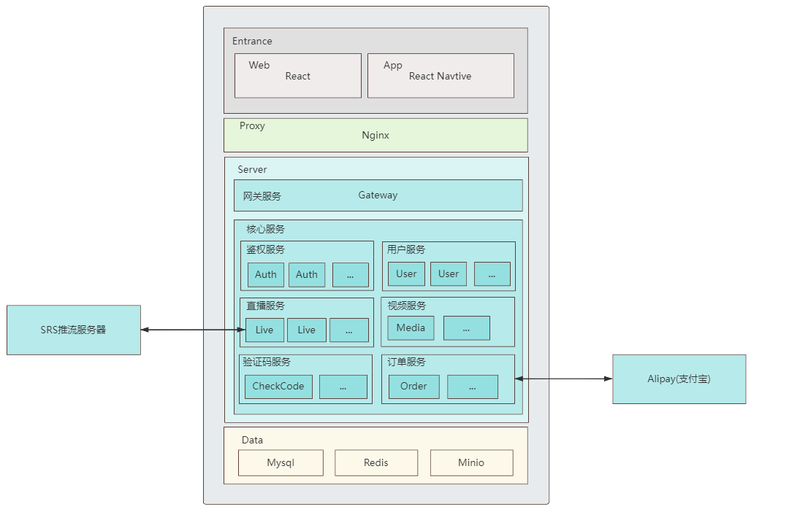

# bee-channel-backend

This is a video website project based on Next.js

Due to time constraints, some code has redundancy. If you have a code cleanliness obsession, please forgive me.

## Technologies Used
- SpringCloud
- SpringBoot
- Service Registration: Nacos
- Distributed Transaction: Seata
- Live Serve: SRS
- Cache、Live Message: Redis
- Data Source: Mysql
- Payment Queue: RabbitMq
- Payment Platform: Alipay SDK

## Structure
